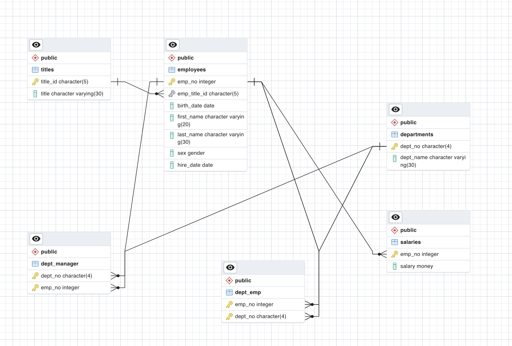

# sql-challenge
DU Data Analysis SQL Challenge:
Research project about people whom Pewlett Packard (a fictional company) employed during the 1980s and 1990s. All that remains of the employee database from that period are six CSV files found in the data folder.

## Data Modeling
Schema diagram of the Pewlet Hackard database

## Data Engineering
The schema contained in **EmployerSQL/EmployeeQueries.sql** can be uploaded and run in PostgreSQL to create the database.
Load the CSV files stored in the data folder. Upload the tables in the following order:
1. titles
2. employees
3. departments
4. salaries, dept_manager and dept_emp can then be uploaded in any order.

## Data Analysis
Ran the following queries on this database.
Queries are stored in **EmployerSQL/EmployeeQueries.sql**.
Output from the queries are stored in **EmployerSQL/query-output**.
* Query 1: List the employee number, last name, first name, sex, and salary of each employee.

* Query 2: List the first name, last name, and hire date for the employees who were hired in 1986.

* Query 3: List the manager of each department along with their department number, department name, employee number, last name, and first name.

* Query 4: List the department number for each employee along with that employee’s employee number, last name, first name, and department name.

* Query 5: List first name, last name, and sex of each employee whose first name is Hercules and whose last name begins with the letter B.

* Query 6: List each employee in the Sales department, including their employee number, last name, and first name.

* Query 7: List each employee in the Sales and Development departments, including their employee number, last name, first name, and department name.

* Query 8: List the frequency counts, in descending order, of all the employee last names (that is, how many employees share each last name).
